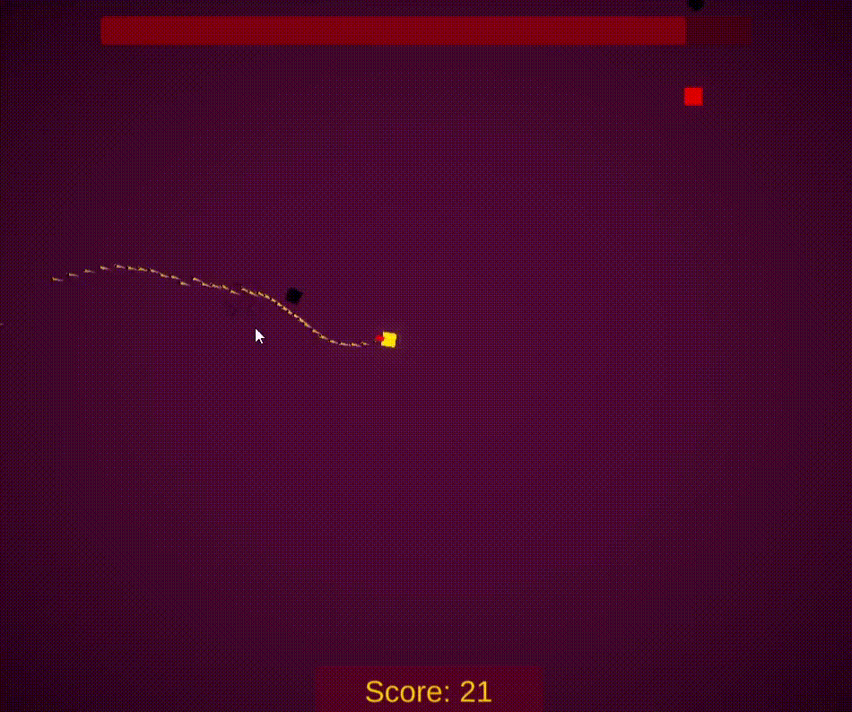

# Mere-Square
Puzzle game jam

# Description
  This is a 2D game that I created for <a href="https://itch.io/jam/mini-jam-71-puzzles">Mini Jam 71:Puzzles</a>  
  This was a 3day(72-hour-long) jam, where I had to create a game for scratch.  
  The theme for this jam was <b>PUZZLE</b>
  The limitation was <b>Combine 2 different game genres</b>  
  I combined a top-down shooter and word guessing  
  This git only contains the code, you can play the game <a href="https://vulpesdev.itch.io/mere-square">here</a>
